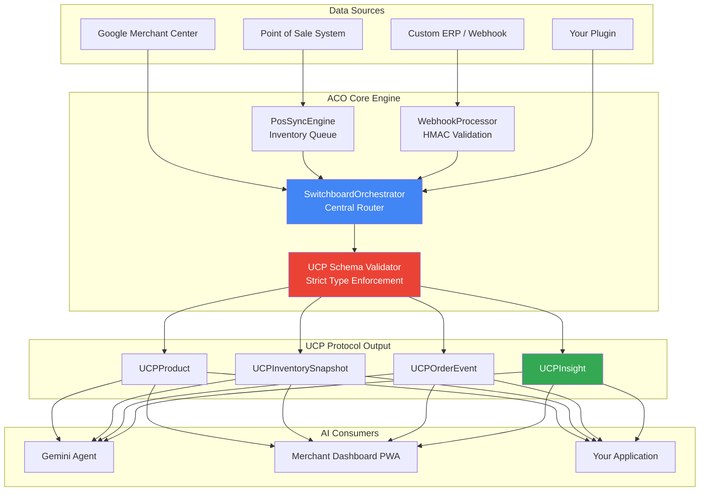

<div align="center">


<h1>Goofre - Agentic Commerce Orchestrator</h1>


<br /><br />

<p><strong>The premier Agentic Commerce Orchestrator (ACO) for Composable Architects.</strong><br/>
Stop building fragile point-to-point API integrations.<br/>
Start speaking the language AI agents actually understand.</p>

[**Live Demo**](https://goofre.io) · [**Quickstart (2 min)**](#-2-minute-quickstart) · [**Architecture**](#-how-it-works) · [**Build a Plugin**](#-build-a-plugin-in-60-seconds) · [**API Docs**](#-api-reference) · [**Discord**](#-community)

</div>

---

## The Problem

Every e-commerce platform speaks a different language. WooCommerce, Shopify, Square, custom ERP — each has its own product schema, inventory format, and webhook shape. Your engineering team has written _(and re-written)_ dozens of brittle integrations to glue them together.

Now you want AI agents to act on this data — but Gemini, GPT-4, and Claude weren't designed to parse seven conflicting catalog formats.

**There is a better way.**

---

## The Solution: Unified Commerce Protocol (UCP)

The Agentic Commerce Orchestrator (ACO) is a **headless orchestration engine** that normalizes all your commerce data into a single, strictly-typed protocol designed natively for AI consumption.

```
Raw Platform Data (any format) → ACO Engine → UCP Schema (AI-ready) → Gemini/Any LLM
```

| Without ACO                                    | With ACO                                                                 |
| ---------------------------------------------- | ------------------------------------------------------------------------ |
| N point-to-point integrations                  | One UCP pipeline                                                         |
| Inconsistent field names, types, currencies    | Strict TypeScript schemas — always predictable                           |
| LLM agents require custom parsing per platform | Any LLM reads UCP natively — zero prompt engineering for data formatting |
| Webhook handling duplicated per vendor         | Unified HMAC-validated webhook processor                                 |
| Inventory sync breaks on schema changes        | PosSyncEngine absorbs upstream changes                                   |

---

## ⚡ The Two-Minute Quick Start

```bash
npx create-goofre-ucp my-commerce-layer
cd my-commerce-layer
npm start
```

_Your admin dashboard is now configured to run at `http://localhost:3000/admin`._

The setup comes with a local zero-dependency SQLite database out-of-the-box, automatically seeded with mock customers, products, and orders. Additionally, `create-goofre-ucp` registers `MockPaymentGateway` and `MockEmailSender` plugins so you can immediately begin building and testing complex Agentic Webhooks.

---

## 📜 The Goofre Manifesto

**Engineering Sovereignty.**

For too long, engineering teams have been beholden to the whims of monolithic commerce vendors, spending endless sprints migrating between generic schema structures. We believe your commerce layer should be inherently yours—extensible, typed, and independent. The Agentic Commerce Orchestrator restores your operational sovereignty while preparing your data for an AI-native future.

---

## 📈 Visual Proof & Business Translation

> _"Stop forcing humans to write glue code that LLMs can generate."_

### Why Business Stakeholders Care:

- **GraphQL & Event-Driven Architecture:** Improves site speed, resulting in direct boosts to Technical SEO and checkout conversion rates.
- **Unified Commerce Protocol:** Lowers total cost of ownership (TCO). You build a plugin once, and all your existing AI agents instantly understand its data structure.
- **Real-Time Insight Engine:** Automates stock anomaly detection, reducing lost revenue and customer support hours.

[](https://vercel.com/new/clone?repository-url=https%3A%2F%2Fgithub.com%2Fgoofre-opensource%2Fagentic_commerce_orchestrator_ACO) [](https://app.netlify.com/start/deploy?repository=https%3A%2F%2Fgithub.com%2Fgoofre-opensource%2Fagentic_commerce_orchestrator_ACO) [](https://railway.app/template)

---

## 🏗 How It Works



### Core Components

| Component                   | Role                                                                                                                                                                |
| --------------------------- | ------------------------------------------------------------------------------------------------------------------------------------------------------------------- |
| **SwitchboardOrchestrator** | Central event bus. All data flows through here. Manages plugin registry, validates UCP schemas, emits typed events.                                                 |
| **PosSyncEngine**           | Dedicated POS inventory synchronization. Handles real-time stock updates with conflict resolution and queue deduplication.                                          |
| **WebhookProcessor**        | Validates HMAC signatures, parses vendor-specific payloads, dispatches to the Switchboard. Supports any signature algorithm.                                        |
| **UCP Schema Layer**        | TypeScript interfaces + runtime validators for `UCPProduct`, `UCPInventorySnapshot`, `UCPOrderEvent`, `UCPInsight`. The contract between raw data and AI consumers. |

---

## 🔌 Build a Plugin in 60 Seconds

Every data source is a plugin. Implement `IGoofRePlugin` — that's the entire contract:

```typescript
import { IGoofRePlugin, UCPProduct, UCPInsight } from '@goofre/core-engine';

export class MyShopPlugin implements IGoofRePlugin {
  readonly id = 'my-shop'; // Unique identifier
  readonly version = '1.0.0';

  /**
   * Transform raw platform product data into a UCP-compliant UCPProduct.
   * This is the only method required for basic product sync.
   */
  async normalizeProduct(raw: MyShopProduct): Promise<UCPProduct> {
    return {
      ucpId: `my-shop::${raw.productId}`,
      sourceId: raw.productId,
      sourcePlatform: 'my-shop',
      title: raw.name,
      description: raw.body_html,
      price: {
        amount: parseFloat(raw.price),
        currency: 'USD',
      },
      inventory: {
        available: raw.inventory_quantity,
        reserved: 0,
        locationId: 'default',
      },
      ucpVersion: '1.0',
      normalizedAt: new Date().toISOString(),
    };
  }
}

// Register with the orchestrator
import { SwitchboardOrchestrator } from '@goofre/core-engine';

const orchestrator = new SwitchboardOrchestrator();
orchestrator.registerPlugin(new MyShopPlugin());
```

---

## 📦 Package Structure

```
agentic_commerce_orchestrator_ACO/
├── packages/
│   ├── core-engine/          # @goofre/core-engine — The orchestration heart
│   │   └── src/
│   │       ├── types/        # UCP schema type definitions
│   │       ├── orchestrator/ # SwitchboardOrchestrator + PosSyncEngine
│   │       └── webhooks/     # WebhookProcessor
│   ├── plugins/              # @goofre/plugins — Reference integrations
│   │   └── src/
│   │       └── google-merchant/ # Google Merchant Center plugin
│   └── mock-server/          # @goofre/mock-server — Hackathon/CI mock APIs
├── tests/integration/        # End-to-end integration tests
└── docker-compose.yml        # Single-command local dev environment
```

---

## 📋 API Reference

### `SwitchboardOrchestrator`

```typescript
const orchestrator = new SwitchboardOrchestrator(config?: OrchestratorConfig);

// Register a data source plugin
orchestrator.registerPlugin(plugin: IGoofRePlugin): void;

// Process a raw event through the UCP pipeline
await orchestrator.process(event: RawEvent): Promise<UCPProduct | UCPInventorySnapshot | UCPOrderEvent>;

// Subscribe to normalized UCP outputs
orchestrator.on('product', (product: UCPProduct) => { ... });
orchestrator.on('inventory', (snapshot: UCPInventorySnapshot) => { ... });
orchestrator.on('order', (order: UCPOrderEvent) => { ... });
orchestrator.on('insight', (insight: UCPInsight) => { ... });
```

### Mock Server Endpoints

| Endpoint             | Method | Description                       |
| -------------------- | ------ | --------------------------------- |
| `/health`            | GET    | Health check                      |
| `/api/insights`      | GET    | AI-ready commerce insights array  |
| `/api/products`      | GET    | Mock UCPProduct catalog           |
| `/api/webhooks/test` | POST   | Echo endpoint for webhook testing |

### UCP Schema Types

```typescript
// See packages/core-engine/src/types/ucp.schema.ts for full definitions
UCPProduct; // Normalized product with pricing and inventory
UCPInventorySnapshot; // Point-in-time inventory state per location
UCPOrderEvent; // Order lifecycle event (created, fulfilled, refunded)
UCPInsight; // AI-generated actionable commerce intelligence
```

---

## 🐳 Docker Quick Reference

```bash
# Start everything (mock server + core engine in watch mode)
docker compose up

# Mock server only (lightest — perfect for PWA frontend dev)
docker compose up mock-server

# Rebuild after package changes
docker compose up --build
```

---

## 🤝 Community

- **Discord:** [discord.gg/goofre](https://discord.gg/goofre)
- **GitHub Discussions:** Ask questions, share plugins
- **Contributing:** See [CONTRIBUTING.md](./CONTRIBUTING.md)
- **Security:** See [SECURITY.md](./SECURITY.md)

---

## 📄 License

MIT — see [LICENSE](./LICENSE).

Built with ❤️ by the Goofre team and open-source contributors.

> **Enterprise / Managed Cloud?** The open-source ACO is the headless engine. For the full Merchant Dashboard, Voice Agent, and managed hosting, visit [goofre.io](https://goofre.io).
