<div align="center">


<h1>Goofre: The Agentic Commerce Orchestrator (ACO)</h1>


<br /><br />

<p>Empowering e-commerce developers to command the agentic future. <br/>
Bypass platform lock-in. Orchestrate Google's commerce stack directly for your merchants.</p>

[**Website**](https://goofre.io) · [**Quickstart (2 min)**](#-the-two-minute-quick-start) · [**Architecture**](#-how-it-works) · [**API Docs**](#-api-reference) · [**Discord**](#-community)

### Instant Deploy

Launch your independent orchestrator in under two minutes:

[](https://railway.app/template?template=https://github.com/goofre-opensource/goofre)
[](https://vercel.com/new/clone?repository-url=https://github.com/goofre-opensource/goofre)
[](https://app.netlify.com/start/deploy?repository=https://github.com/goofre-opensource/goofre)

</div>

---

## The Problem: The Agentic Shift

E-commerce is undergoing a massive, two-front disruption that is dismantling the last two decades of industry standards:

1. **The Conversational Migration:** Consumer shopping is rapidly migrating from traditional website storefronts to conversational interfaces inside Gemini, ChatGPT, Copilot, and Claude.
2. **The Platform Black Box:** Legacy e-commerce platforms are transforming into closed, fully automated black boxes to sell "convenience" directly to merchants.

This raises an existential question: **Where does the custom e-commerce developer fit when the platform becomes autonomous and the storefront becomes a chat window?**

---

## The Solution: Become the Orchestrator

Goofre elevates developers from mere integrators to true **Agentic Commerce Orchestrators**.

Acting as a high-performance switchboard, Goofre wires directly into the massive infrastructure of Google’s business and commerce solutions—the underlying foundation of the Unified Commerce Protocol (UCP). It enables you to orchestrate agentic commerce workflows without any reliance on third-party e-commerce platforms or website builders.

With Goofre, you own the infrastructure. You can bundle, optimize, and deliver AI-native commerce and marketing services directly to your merchants, entirely on your terms.

### How It Works: Harnessing the Google Stack

Google Search, Chrome, and Gemini serve billions of active users daily, making them the ultimate discovery and conversion engines. Goofre leverages this by turning Google Merchant Center (GMC) into your core Product Information Management (PIM) and orchestration hub.

- **One-Way Data Synchronization:** Goofre seamlessly syncs raw SKU and catalog data from legacy e-commerce platforms directly into GMC.
- **Intelligent Diagnostics:** The orchestrator autonomously identifies, flags, and brings your attention to critical feed issues or policy violations within GMC so you can fix them proactively.
- **Full-Spectrum Orchestration:** Beyond the catalog, Goofre orchestrates the merchant's entire agentic lifecycle—powering dynamic advertising, sales optimization, automated customer service, and real-time inventory management directly through Google's unified ecosystem.

---

## ⚡ The Two-Minute Quick Start

```bash
npx create-goofre-ucp my-commerce-layer
cd my-commerce-layer
npm start
```

_Your admin dashboard is now configured to run at `http://localhost:3000/admin`._

The setup comes with a local zero-dependency SQLite database out-of-the-box, automatically seeded with mock customers, products, and orders. Additionally, `create-goofre-ucp` registers `MockPaymentGateway` and `MockEmailSender` plugins so you can immediately begin building and testing complex Agentic Webhooks.

---

## The Goofre Manifesto: Engineering Sovereignty

We believe that e-commerce developers are the true architects of modern retail. Goofre exists to grant them absolute technical sovereignty.

1. **We build orchestrators, not platforms.** We do not dictate where your data lives; we give you the power to command it.
2. **True Independence.** We empower developers to become independent orchestrators, delivering platform-free, AI-native commerce experiences directly to their merchants.
3. **Agent-First Architecture.** The future of commerce is agentic. We provide the robust, Google-stack-powered infrastructure necessary to build systems that act, decide, and optimize autonomously.
4. **No Vendor Lock-In.** Your merchants' data, workflows, and logic belong to them, orchestrated by you.

Build without boundaries. Orchestrate the future.

---

## 📈 Visual Proof & Business Translation

Goofre doesn't just improve developer experience; it fundamentally rewrites the merchant's unit economics. When selling your Goofre-powered architecture to merchants, translate your technical stack into these immediate business outcomes:

- **Eliminate Legacy Overhead:** Stop paying the "ecosystem tax." By orchestrating commerce directly, your merchants instantly eliminate traditional platform subscription fees, bloated third-party app costs, and expensive ad-performance agency retainers.
- **Turnkey Agentic Commerce:** Future-proof merchants instantly. Goofre seamlessly orchestrates Google's powerful, natively integrated commerce stack (Search, Merchant Center, Gemini) to drive tangible, automated business results without relying on a passive website.
- **Scale Without Store-Building:** Stop wasting hundreds of development hours designing, testing, and maintaining fragile website templates. Deploy, manage, and scale intelligent agentic commerce workflows across multiple merchants directly from a single Goofre orchestrator instance.

---

## 🏗 How It Works

```mermaid
flowchart TB
    %% ─── INPUT SOURCES ─────────────────────────────────────────────────────────
    subgraph INPUT["🔌 Data Sources"]
        direction TB
        GMC["Google Merchant Center"]
        POS["Point of Sale System"]
        ERP["Custom ERP / Webhook"]
        GCCS["Google Commerce-Centric Stack"]
    end

    %% ─── UCP CHECKOUT ──────────────────────────────────────────────────────────
    subgraph CHECKOUT["🛒 UCP Checkout Layer"]
        direction TB
        CO_API["Checkout API\nEndpoint"]
        APY["APay / Payments\nGateway Adapter"]
        CO_API --> APY
    end

    %% ─── GOOFRE CORE ENGINE ────────────────────────────────────────────────────
    subgraph CORE["⚙️ Goofre Core Engine  ·  @goofre/core-engine"]
        direction LR

        subgraph INGEST["Ingestion"]
            WH["WebhookProcessor\n(HMAC Validation)"]
            PS["PosSyncEngine\n(Inventory Queue\n+ Deduplication)"]
        end

        subgraph ORCHESTRATION["Orchestration"]
            SW["SwitchboardOrchestrator\n(Central Event Bus\n· Plugin Registry\n· Timeout Guard)"]
            OTE["OTEn Engine\n(State Machine)"]
            SL["State Lock\n(Concurrency Guard)"]
            OTE --> SL
        end

        subgraph SCHEMA["UCP Schema Layer  ·  Runtime Validation"]
            P["UCPProduct\n(variants, GTIN, MPN)"]
            IS["UCPInventorySnapshot\n(delta, reason, location)"]
            OE["UCPOrderEvent\n(6 lifecycle events)"]
            IN["UCPInsight\n(8 insight types\n· severity · impact)"]
        end

        WH --> SW
        PS --> SW
        SW --> OTE
        SW --> P & IS & OE & IN
    end

    %% ─── PLUGIN LAYER ──────────────────────────────────────────────────────────
    subgraph PLUGINS["🔧 @goofre/plugins"]
        direction LR
        GP["GoogleMerchantPlugin\n(normalizeProduct\nnormalizeInventory\nnormalizeOrder)"]
        PP["create-goofre-ucp\n(CLI Scaffolding)"]
        IP["IGoofRePlugin Interface\n(@goofre/interfaces)"]
        IP -.->|"implements"| GP
    end

    %% ─── GOOGLE API STACK ──────────────────────────────────────────────────────
    subgraph GOOGLE["☁️ Google API Stack"]
        direction TB
        MC["Merchant Center\n(PIM + Feed Hub)"]
        SC["Search Console"]
        GA_ADS["Google Ads\n(Performance Max)"]
        BP["Business Profile\nGBP"]
        GA4["GA4 Analytics"]
        GW["Google Wallet\nLoyalty / Passes"]
    end

    %% ─── MOCK SERVER ───────────────────────────────────────────────────────────
    subgraph MOCK["🧪 @goofre/mock-server  ·  Port 3001"]
        direction LR
        MH["/health"]
        MI["/api/insights"]
        MPR["/api/products"]
        MWT["/api/webhooks/test"]
    end

    %% ─── CI/CD PIPELINE ────────────────────────────────────────────────────────
    subgraph CICD["🚀 CI/CD  ·  GitHub Actions"]
        direction LR
        L["Lint &\nTypecheck"]
        T["Integration\nTests + Coverage\n(Codecov)"]
        B["Build\nAll Packages\n(Turbo)"]
        MS["Mock Server\nSmoke Test"]
        L --> T & B --> MS
    end

    %% ─── DASHBOARD LITE APP ─────────────────────────────────────────────────────
    subgraph DASH["📊 apps/dashboard-lite  ·  Next.js 15 PWA"]
        direction TB

        subgraph MERCHANT_VIEW["Merchant View"]
            direction LR
            AIF["AgenticInsightsFeed\n(real-time)"]
            AEQ["AgenticEnrichmentQueue"]
            PA["PredictiveAnalyticsRow"]
            BCS["BrandContextScore"]
            CS["ConversationalSearch\n(Gemini)"]
            HZM["HeroZombieMatrix\n(SKU Health)"]
            MRC["MorningRitualCards']"]
            PEF["PlainEnglishFeed"]
        end

        subgraph PRO_VIEW["Pro View"]
            direction LR
            GT["GlobalTriage\n(Multi-Merchant)"]
            MAB["MassActionBar"]
            PG["PortfolioGrid"]
        end

        subgraph SHARED_UI["Shared UI Components"]
            TL["TransactionLedger"]
            SB["StatusBoard"]
            CON["ConnectivityPulse"]
            TN["TopNav\n(Merchant | Pro | Portfolio | Settings)"]
            PRA["PredictiveReplenishAlert"]
            RG["RetentionGauge"]
            MH2["MetadataHealth"]
            AOV["AgenticAOV"]
        end
    end

    %% ─── OUTPUT / CONSUMERS ─────────────────────────────────────────────────────
    subgraph OUTPUT["🤖 AI & Output Consumers"]
        direction LR
        GEM["Gemini Agent\n(Voice + Action)"]
        DASH_OUT["Dashboard PWA\n(dashboard-lite)"]
        EXT["Your Application\n(any consumer)"]
    end

    %% ─── CONNECTIONS ────────────────────────────────────────────────────────────
    ERP --> WH
    POS --> PS
    GMC --> GP --> SW
    GCCS --> SW
    CHECKOUT --> SW

    SW --> GOOGLE
    MC --> SW

    IN & OE & IS & P --> GEM & DASH_OUT & EXT
    MOCK -.->|"dev / CI data"| DASH
    MOCK -.->|"CI smoke test"| MS

    %% ─── STYLES ─────────────────────────────────────────────────────────────────
    style CORE fill:#1a1a2e,color:#eee,stroke:#4285F4,stroke-width:2px
    style SW fill:#4285F4,color:#fff
    style IN fill:#34A853,color:#fff
    style WH fill:#EA4335,color:#fff
    style PS fill:#FBBC04,color:#000
    style GOOGLE fill:#0f3460,color:#eee,stroke:#4285F4
    style DASH fill:#16213e,color:#eee,stroke:#7c3aed,stroke-width:2px
    style CICD fill:#0d0d0d,color:#eee,stroke:#34A853,stroke-width:1px
    style CHECKOUT fill:#1a0a2e,color:#eee,stroke:#9333ea
    style INPUT fill:#1c1c1c,color:#eee,stroke:#555
    style OUTPUT fill:#0a1628,color:#eee,stroke:#34A853
    style PLUGINS fill:#1c1c1c,color:#eee,stroke:#FBBC04
    style MOCK fill:#1c1c1c,color:#eee,stroke:#EA4335
```



### Core Components

| Component                   | Role                                                                                                                                                                |
| --------------------------- | ------------------------------------------------------------------------------------------------------------------------------------------------------------------- |
| **SwitchboardOrchestrator** | Central event bus. All data flows through here. Manages plugin registry, validates UCP schemas, emits typed events.                                                 |
| **PosSyncEngine**           | Dedicated POS inventory synchronization. Handles real-time stock updates with conflict resolution and queue deduplication.                                          |
| **WebhookProcessor**        | Validates HMAC signatures, parses vendor-specific payloads, dispatches to the Switchboard. Supports any signature algorithm.                                        |
| **UCP Schema Layer**        | TypeScript interfaces + runtime validators for `UCPProduct`, `UCPInventorySnapshot`, `UCPOrderEvent`, `UCPInsight`. The contract between raw data and AI consumers. |

---

## 🔌 Build a Plugin in 60 Seconds

Every data source is a plugin. Implement `IGoofRePlugin` — that's the entire contract:

```typescript
import { IGoofRePlugin, UCPProduct, UCPInsight } from '@goofre/core-engine';

export class MyShopPlugin implements IGoofRePlugin {
  readonly id = 'my-shop'; // Unique identifier
  readonly version = '1.0.0';

  /**
   * Transform raw platform product data into a UCP-compliant UCPProduct.
   * This is the only method required for basic product sync.
   */
  async normalizeProduct(raw: MyShopProduct): Promise<UCPProduct> {
    return {
      ucpId: `my-shop::${raw.productId}`,
      sourceId: raw.productId,
      sourcePlatform: 'my-shop',
      title: raw.name,
      description: raw.body_html,
      price: {
        amount: parseFloat(raw.price),
        currency: 'USD',
      },
      inventory: {
        available: raw.inventory_quantity,
        reserved: 0,
        locationId: 'default',
      },
      ucpVersion: '1.0',
      normalizedAt: new Date().toISOString(),
    };
  }
}

// Register with the orchestrator
import { SwitchboardOrchestrator } from '@goofre/core-engine';

const orchestrator = new SwitchboardOrchestrator();
orchestrator.registerPlugin(new MyShopPlugin());
```

---

## 📦 Package Structure

```
agentic_commerce_orchestrator_ACO/
├── packages/
│   ├── core-engine/          # @goofre/core-engine — The orchestration heart
│   │   └── src/
│   │       ├── types/        # UCP schema type definitions
│   │       ├── orchestrator/ # SwitchboardOrchestrator + PosSyncEngine
│   │       └── webhooks/     # WebhookProcessor
│   ├── plugins/              # @goofre/plugins — Reference integrations
│   │   └── src/
│   │       └── google-merchant/ # Google Merchant Center plugin
│   └── mock-server/          # @goofre/mock-server — Hackathon/CI mock APIs
├── tests/integration/        # End-to-end integration tests
└── docker-compose.yml        # Single-command local dev environment
```

---

## 📋 API Reference

### `SwitchboardOrchestrator`

```typescript
const orchestrator = new SwitchboardOrchestrator(config?: OrchestratorConfig);

// Register a data source plugin
orchestrator.registerPlugin(plugin: IGoofRePlugin): void;

// Process a raw event through the UCP pipeline
await orchestrator.process(event: RawEvent): Promise<UCPProduct | UCPInventorySnapshot | UCPOrderEvent>;

// Subscribe to normalized UCP outputs
orchestrator.on('product', (product: UCPProduct) => { ... });
orchestrator.on('inventory', (snapshot: UCPInventorySnapshot) => { ... });
orchestrator.on('order', (order: UCPOrderEvent) => { ... });
orchestrator.on('insight', (insight: UCPInsight) => { ... });
```

### Mock Server Endpoints

| Endpoint             | Method | Description                       |
| -------------------- | ------ | --------------------------------- |
| `/health`            | GET    | Health check                      |
| `/api/insights`      | GET    | AI-ready commerce insights array  |
| `/api/products`      | GET    | Mock UCPProduct catalog           |
| `/api/webhooks/test` | POST   | Echo endpoint for webhook testing |

### UCP Schema Types

```typescript
// See packages/core-engine/src/types/ucp.schema.ts for full definitions
UCPProduct; // Normalized product with pricing and inventory
UCPInventorySnapshot; // Point-in-time inventory state per location
UCPOrderEvent; // Order lifecycle event (created, fulfilled, refunded)
UCPInsight; // AI-generated actionable commerce intelligence
```

---

## 🐳 Docker Quick Reference

```bash
# Start everything (mock server + core engine in watch mode)
docker compose up

# Mock server only (lightest — perfect for PWA frontend dev)
docker compose up mock-server

# Rebuild after package changes
docker compose up --build
```

---

## 🤝 Community

- **Discord:** [discord.gg/goofre](https://discord.gg/goofre)
- **GitHub Discussions:** Ask questions, share plugins
- **Contributing:** See [CONTRIBUTING.md](./CONTRIBUTING.md)
- **Security:** See [SECURITY.md](./SECURITY.md)

---

## 📄 License

MIT — see [LICENSE](./LICENSE).

Built with ❤️ by the Goofre team and open-source contributors.

> **Enterprise / Managed Cloud?** The open-source ACO is the headless engine. For the full Merchant Dashboard, Voice Agent, and managed hosting, visit [goofre.io](https://goofre.io).
