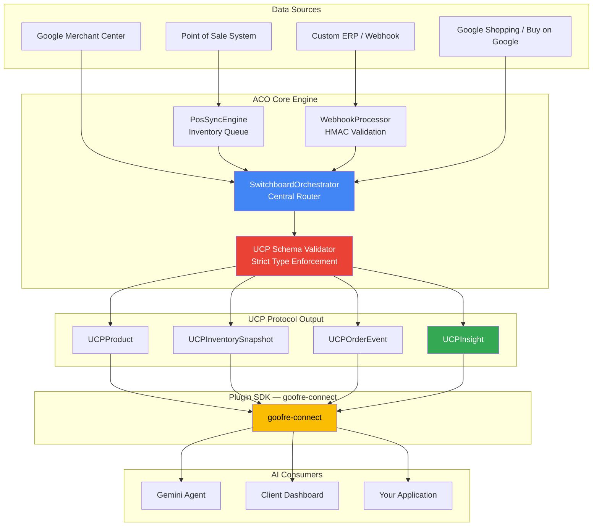

<div align="center">


<h1>Goofre: The Agentic Commerce Orchestrator (ACO)</h1>


<br /><br />

<p>Empowering e-commerce developers to command the agentic future. <br/>
Bypass platform lock-in. Orchestrate Google's commerce stack directly.</p>

[**Quickstart (2 min)**](#-the-two-minute-quick-start) · [**Architecture**](#-how-it-works) · [**API Docs**](#-api-reference) · [**Discord**](#-community) · [**Website**](https://goofre.io)

### Instant Deploy

Launch your independent orchestrator in under two minutes:

[](https://railway.app/template?template=https://github.com/goofre-opensource/goofre)
[](https://vercel.com/new/clone?repository-url=https://github.com/goofre-opensource/goofre)
[](https://app.netlify.com/start/deploy?repository=https://github.com/goofre-opensource/goofre)

</div>

---

## The Problem: The Agentic Shift

E-commerce is undergoing a massive, two-front disruption that is dismantling the last two decades of industry standards:

1. **The Conversational Migration:** Consumer shopping is rapidly migrating from traditional website storefronts to conversational interfaces inside Gemini, ChatGPT, Copilot, and Claude.
2. **The Platform Black Box:** Legacy e-commerce platforms are transforming into closed, fully automated black boxes to sell "convenience" directly to merchants.

This raises an existential question: **Where does the custom e-commerce developer fit when the platform becomes autonomous and the storefront becomes a chat window?**

---

## The Solution: Become the Orchestrator

Goofre elevates developers from mere integrators to true **Agentic Commerce Orchestrators**.

Acting as a high-performance switchboard, Goofre wires directly into the massive infrastructure of Google’s business and commerce solutions—the underlying foundation of the Unified Commerce Protocol (UCP). It enables you to orchestrate agentic commerce workflows without any reliance on third-party e-commerce platforms or website builders.

With Goofre, you own the infrastructure. You can bundle, optimize, and deliver AI-native commerce and marketing services directly to your clients, entirely on your terms.

### How It Works: Harnessing the Google Stack

Google operates the most powerful commerce-centric infrastructure on the planet — and most of it goes severely under-utilised because these tools exist in **isolated silos**. Goofre's job is to break those silos and wire them into a single, agentic orchestration layer.

#### The Google Commerce Stack — Connected by Goofre

| Google Tool | Silo State Today | Orchestrated with Goofre |
|---|---|---|
| **Google Merchant Center (GMC)** | Manual feed uploads, reactive policy fixes | Becomes your **PIM** — canonical product source of truth, auto-synced, auto-validated |
| **Google Business Profile (GBP)** | Updated manually, disconnected from inventory | Auto-updated with real stock levels, hours, and offers |
| **Google Analytics (GA4)** | Passive reporting dashboard | Feeds real-time behavioural signals into `UCPInsight` for dynamic pricing and personalisation |
| **Google Ads (GAds)** | Campaign managed separately from product data | Automatically retargeted from live GMC feed — no manual audience refreshes |
| **Google Search Console (GSC)** | SEO monitoring only | Surfaces crawl and indexing data as signals for agentic product content optimisation |
| **Performance Max / Studio** | Standalone creative tools | Triggered autonomously from UCP events — a new SKU fires an ad creative pipeline |
| **Gemini / Vertex AI** | Experimented with individually | Unified inference layer — the reasoning engine across the full orchestration loop |

#### From Siloed Tools to Agentic Commerce Infrastructure

These tools do not natively talk to each other. A business managing Shopify, GMC, GA4, and GAds is juggling four separate platforms with four separate logins, four separate data models — and constantly losing context between them.

**Goofre resolves this by making GMC the single source of truth (your PIM)**, then projecting normalised UCP-typed data outward to every other Google service:

- **One-Way Data Synchronisation:** Raw SKU and catalog data from Shopify, WooCommerce, Magento, or any POS flows into GMC as the canonical record.
- **Intelligent Diagnostics:** The orchestrator autonomously surfaces GMC feed violations, policy flags, and data quality gaps — before they tank ad spend.
- **Commerce Intelligence Layer:** GA4 behavioural data, GSC search signals, and GAds performance metrics are ingested as `UCPInsight` events, giving the AI layer contextual business intelligence — not just raw product records.
- **Full-Spectrum Agentic Orchestration:** From dynamic advertising (GAds + Performance Max) to automated customer communication and real-time inventory management — Goofre turns Google's fragmented commerce stack into a *single programmable platform* you control.

> **You don't replace Google's tools. You become the layer that makes them work together.**

---

## ⚡ The Two-Minute Quick Start

### Before You Begin — Google API Keys

Goofre connects to the live Google Commerce Stack. You'll need these credentials when connecting real commerce accounts:

| Credential | Where to get it | Used for |
|---|---|---|
| **GMC Merchant ID** | [Google Merchant Center](https://merchants.google.com) → Settings → Business info | Product feed sync, feed diagnostics |
| **Google OAuth 2.0 Client** | [Google Cloud Console](https://console.cloud.google.com) → APIs & Services → Credentials | Authenticating all Google API calls |
| **Content API for Shopping** | Enable in Cloud Console → Library | Read/write GMC product data |
| **GA4 Measurement ID** *(optional)* | GA4 → Admin → Data Streams | Feeding behavioural signals into `UCPInsight` |
| **Google Ads Developer Token** *(optional)* | [Google Ads API Centre](https://developers.google.com/google-ads/api/docs/get-started/dev-token) | Automated campaign sync |

> 💡 **Mock mode available** — no keys needed for local development. Real credentials are only required when connecting to live commerce accounts.

### Install & Run

```bash
npx create-goofre-ucp my-commerce-layer
cd my-commerce-layer
cp .env.example .env
# Fill in GOOGLE_CLIENT_ID, GOOGLE_CLIENT_SECRET, GMC_MERCHANT_ID
npm start
```

_Your admin dashboard is now running at `http://localhost:3000/admin`._

The setup ships with a zero-dependency **SQLite database**, automatically seeded with mock customers, products, and orders. `create-goofre-ucp` also registers `MockPaymentGateway` and `MockEmailSender` plugins so you can build and test full Agentic Webhooks locally — **without touching a live GMC account**.

---

## 💡 What You Can Build

Goofre is a set of primitives, not a locked product. Here's what developers in your position are building:

| Project | Difficulty | Description |
|---|---|---|
| **Product Feed Optimizer** | 🟢 Beginner | Auto-detect and fix Google Merchant Center feed errors across 100+ SKUs |
| **Cross-Platform Inventory Sync** | 🟡 Intermediate | Real-time inventory bridge between Shopify POS and GMC |
| **AI Shopping Agent** | 🔴 Advanced | Gemini-powered conversational commerce using UCP-normalized data |
| **Client Dashboard App** | 🟡 Intermediate | Mobile-first command center — inventory alerts, feed health, AI insights — without clients needing to understand the underlying Google stack |
| **Multi-Merchant Orchestrator** | 🔴 Advanced | Manage 50+ merchants from a single Goofre instance |
| **Dynamic Pricing Engine** | 🟡 Intermediate | Auto-adjust prices based on `UCPInsight` competition data |


> 💡 **Client Dashboard Idea**: Build a dashboard app that gives clients a real-time view — inventory alerts, feed health, AI insights — without needing them to understand the underlying Google stack. Think of it as *their control tower* while you remain the orchestrator.

---

## The Goofre Manifesto: Engineering Sovereignty

We believe that e-commerce developers are the true architects of modern retail. Goofre exists to grant them absolute technical sovereignty.

1. **We build orchestrators, not platforms.** We do not dictate where your data lives; we give you the power to command it.
2. **True Independence.** We empower developers to become independent orchestrators, delivering platform-free, AI-native commerce experiences directly to their clients.
3. **Agent-First Architecture.** The future of commerce is agentic. We provide the robust, Google-stack-powered infrastructure necessary to build systems that act, decide, and optimize autonomously.
4. **No Vendor Lock-In.** Your clients' data, workflows, and logic belong to them, orchestrated by you.

Build without boundaries. Orchestrate the future.

---

## 📈 Visual Proof & Business Translation

Goofre doesn't just improve developer experience; it fundamentally rewrites the unit economics of commerce delivery. Translate your Goofre-powered architecture into these immediate business outcomes:

- **Eliminate Legacy Overhead:** Stop paying the "ecosystem tax." By orchestrating commerce directly, you eliminate traditional platform subscription fees, bloated third-party app costs, and expensive ad-performance agency retainers.
- **Turnkey Agentic Commerce:** Future-proof your commerce stack instantly. Goofre seamlessly orchestrates Google's powerful, natively integrated commerce infrastructure (Search, Merchant Center, Gemini) to drive tangible, automated business results without relying on a passive website.
- **Scale Without Store-Building:** Stop wasting hundreds of development hours designing, testing, and maintaining fragile website templates. Deploy, manage, and scale intelligent agentic commerce workflows across multiple clients directly from a single Goofre orchestrator instance.

[](https://vercel.com/new/clone?repository-url=https%3A%2F%2Fgithub.com%2Fgoofre-opensource%2Fagentic_commerce_orchestrator_ACO) [](https://app.netlify.com/start/deploy?repository=https%3A%2F%2Fgithub.com%2Fgoofre-opensource%2Fagentic_commerce_orchestrator_ACO) [](https://railway.app/template)

---

## 🏗 How It Works



### Core Components

| Component                   | Role                                                                                                                                                                |
| --------------------------- | ------------------------------------------------------------------------------------------------------------------------------------------------------------------- |
| **SwitchboardOrchestrator** | Central event bus. All data flows through here. Manages plugin registry, validates UCP schemas, emits typed events.                                                 |
| **PosSyncEngine**           | Dedicated POS inventory synchronization. Handles real-time stock updates with conflict resolution and queue deduplication.                                          |
| **WebhookProcessor**        | Validates HMAC signatures, parses vendor-specific payloads, dispatches to the Switchboard. Supports any signature algorithm.                                        |
| **UCP Schema Layer**        | TypeScript interfaces + runtime validators for `UCPProduct`, `UCPInventorySnapshot`, `UCPOrderEvent`, `UCPInsight`. The contract between raw data and AI consumers. |

---

## 🔑 Understanding UCP & The Google Stack

<details>
<summary><b>New to Google's commerce infrastructure? Start here.</b></summary>

### The Google Commerce Stack (simplified)

| Layer | Service | What It Does |
|---|---|---|
| Discovery | Google Search + Shopping | How consumers find products |
| Intelligence | Gemini | AI that powers recommendations, agents, insights |
| Catalog | Google Merchant Center (GMC) | The source-of-truth for product data |
| Ads | Google Ads + Performance Max | Automated advertising across Google surfaces |
| Analytics | GA4 + Merchant Reports | Performance measurement |

### What is UCP?

**Unified Commerce Protocol** is Goofre's standardized schema for normalizing commerce data from *any* source into a format that Google's stack natively understands. Think of it as:

- **For Shopify devs**: Like the Shopify REST Admin API, but platform-agnostic
- **For WooCommerce devs**: Like the WooCommerce REST API v3, but AI-native
- **For agency devs**: One schema to normalize all your clients' catalogs

### UCP Core Types

| Type | Purpose | Think of it as... |
|---|---|---|
| `UCPProduct` | Normalized product with pricing + inventory | A "super product object" |
| `UCPInventorySnapshot` | Point-in-time stock by location | Real-time stock checker |
| `UCPOrderEvent` | Order lifecycle events | Webhook payloads, standardized |
| `UCPInsight` | AI-generated commerce intelligence | "Your AI co-pilot's notes" |

</details>

---

## 🔌 Build a Plugin in 60 Seconds

Every data source is a plugin. Implement `IGoofRePlugin` — that's the entire contract:

```typescript
import { IGoofRePlugin, UCPProduct, UCPInsight } from '@goofre/core-engine';

export class MyShopPlugin implements IGoofRePlugin {
  readonly id = 'my-shop'; // Unique identifier
  readonly version = '1.0.0';

  /**
   * Transform raw platform product data into a UCP-compliant UCPProduct.
   * This is the only method required for basic product sync.
   */
  async normalizeProduct(raw: MyShopProduct): Promise<UCPProduct> {
    return {
      ucpId: `my-shop::${raw.productId}`,
      sourceId: raw.productId,
      sourcePlatform: 'my-shop',
      title: raw.name,
      description: raw.body_html,
      price: {
        amount: parseFloat(raw.price),
        currency: 'USD',
      },
      inventory: {
        available: raw.inventory_quantity,
        reserved: 0,
        locationId: 'default',
      },
      ucpVersion: '1.0',
      normalizedAt: new Date().toISOString(),
    };
  }
}

// Register with the orchestrator
import { SwitchboardOrchestrator } from '@goofre/core-engine';

const orchestrator = new SwitchboardOrchestrator();
orchestrator.registerPlugin(new MyShopPlugin());
```

---

## 📦 Package Structure

```
agentic_commerce_orchestrator_ACO/
├── packages/
│   ├── core-engine/          # @goofre/core-engine — The orchestration heart
│   │   └── src/
│   │       ├── types/        # UCP schema type definitions
│   │       ├── orchestrator/ # SwitchboardOrchestrator + PosSyncEngine
│   │       └── webhooks/     # WebhookProcessor
│   ├── plugins/              # @goofre/plugins — Reference integrations
│   │   └── src/
│   │       └── google-merchant/ # Google Merchant Center plugin
│   └── mock-server/          # @goofre/mock-server — Hackathon/CI mock APIs
├── tests/integration/        # End-to-end integration tests
└── docker-compose.yml        # Single-command local dev environment
```

---

## 📋 API Reference

### `SwitchboardOrchestrator`

```typescript
const orchestrator = new SwitchboardOrchestrator(config?: OrchestratorConfig);

// Register a data source plugin
orchestrator.registerPlugin(plugin: IGoofRePlugin): void;

// Process a raw event through the UCP pipeline
await orchestrator.process(event: RawEvent): Promise<UCPProduct | UCPInventorySnapshot | UCPOrderEvent>;

// Subscribe to normalized UCP outputs
orchestrator.on('product', (product: UCPProduct) => { ... });
orchestrator.on('inventory', (snapshot: UCPInventorySnapshot) => { ... });
orchestrator.on('order', (order: UCPOrderEvent) => { ... });
orchestrator.on('insight', (insight: UCPInsight) => { ... });
```

### Mock Server Endpoints

| Endpoint             | Method | Description                       |
| -------------------- | ------ | --------------------------------- |
| `/health`            | GET    | Health check                      |
| `/api/insights`      | GET    | AI-ready commerce insights array  |
| `/api/products`      | GET    | Mock UCPProduct catalog           |
| `/api/webhooks/test` | POST   | Echo endpoint for webhook testing |

### UCP Schema Types

```typescript
// See packages/core-engine/src/types/ucp.schema.ts for full definitions
UCPProduct; // Normalized product with pricing and inventory
UCPInventorySnapshot; // Point-in-time inventory state per location
UCPOrderEvent; // Order lifecycle event (created, fulfilled, refunded)
UCPInsight; // AI-generated actionable commerce intelligence
```

---

## 🐳 Docker Quick Reference

```bash
# Start everything (mock server + core engine in watch mode)
docker compose up

# Mock server only (lightest — perfect for frontend dev)
docker compose up mock-server

# Rebuild after package changes
docker compose up --build
```

---

## 🗺️ Roadmap

### Now (v1.x)
- [x] Core SwitchboardOrchestrator with UCP schema
- [x] Google Merchant Center plugin
- [x] Mock server for local development
- [x] `npx create-goofre-ucp` scaffolding
- [x] Docker Compose dev environment

### Next (v2.x)
- [ ] **Multi-LLM Compatibility** — Swap between Gemini, GPT-4, Claude, and Llama as your AI backbone. Goofre orchestrates commerce; your choice of brain powers the intelligence.
- [ ] Shopify / WooCommerce / Magento source plugins (community-built)
- [ ] Webhook-driven real-time sync (beyond polling)
- [ ] UCPInsight: AI-powered feed diagnostics with actionable fix suggestions

### Future (v3.x)
- [ ] MCP Server protocol — expose your orchestrator as a tool for any AI agent
- [ ] Multi-merchant tenant isolation
- [ ] Client dashboard reference app
- [ ] Voice agent integration (Gemini Live)

Want to influence the roadmap? [Open a feature request →](https://github.com/goofre-opensource/agentic_commerce_orchestrator_ACO/issues/new?template=feature_request.yml)

---

## 🌐 Learn More

Visit [goofre.com](https://www.goofre.com) for documentation, guides, and community resources.

---

## 🤝 Community

- **Discord:** [discord.gg/goofre](https://discord.gg/goofre)
- **GitHub Discussions:** Ask questions, share plugins
- **Contributing:** See [CONTRIBUTING.md](./CONTRIBUTING.md)
- **Security:** See [SECURITY.md](./SECURITY.md)

---

## 📄 License

**BSL 1.1** (Business Source License) — see [LICENSE](./LICENSE).

You can read, modify, and use Goofre in production to orchestrate commerce for your clients. The only restriction: you cannot offer Goofre as a competing managed service. On **March 14, 2030**, the code automatically converts to **Apache 2.0** with no restrictions.

> **Why BSL?** We want the source code to be fully transparent while protecting our ability to fund development through Goofre OS. Companies like HashiCorp, Sentry, and CockroachDB use the same model.

Built with ❤️ by the Goofre team and open-source contributors.
